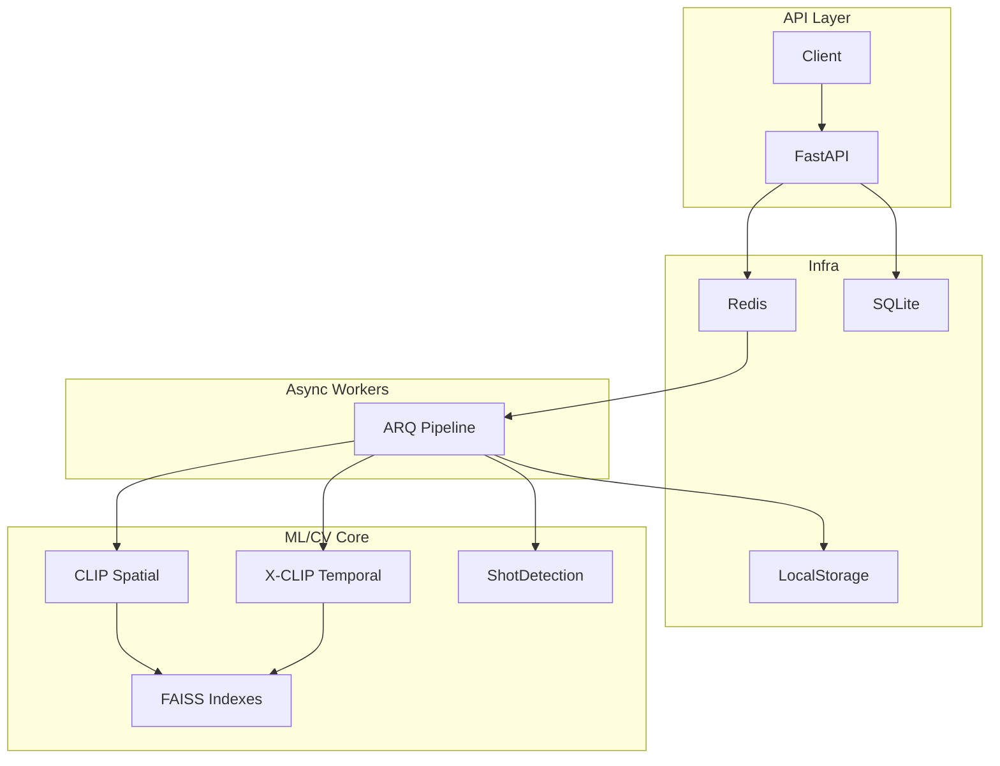
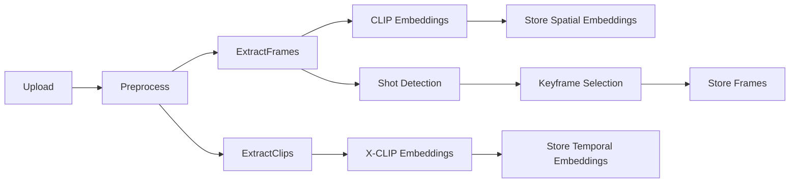

# FrameMind

**Production-grade Video Intelligence Engine** with CLIP-based frame selection and VLM integration.

FrameMind ingests videos, performs intelligent frame selection using computer vision and machine learning, and answers semantic queries using Vision-Language Models (GPT-4V, Claude).

**Note:** Version 2 for this repo coming soon with even more efficient processing. *Hint:* Will be implementing the [AutoGaze paper](https://autogaze.github.io/) for more efficient token management while keeping visual information conserved as much as possible.

## Features

- **Dual-Stream Retrieval**: Spatial CLIP + temporal X-CLIP for better video understanding
- **Temporal Understanding**: Clip-level embeddings capture motion and actions
- **Intelligent Frame Selection**: CLIP embeddings + shot detection reduce thousands of frames to key frames
- **Async Processing Pipeline**: Upload → Preprocess → Extract → Analyze → Complete
- **VLM Integration**: Query videos using natural language with GPT-4V or Claude
- **Local-First Architecture**: Run entirely on your machine with Docker
- **Production Ready**: Rate limiting, caching, retries, and structured logging

## Architecture



## Processing Workflow



## Query Workflow


## Quick Start

### Prerequisites

- Python 3.11+
- Docker & Docker Compose
- FFmpeg (for local development)
- Redis 8.0 (for async pipeline and rate limiting)

### Option 1: Docker (Recommended)

```bash
# Clone and enter directory
git clone https://github.com/Abhijithreddydasari/FrameMind.git
cd framemind

# Copy environment file
cp .env.example .env

# Start all services
make docker-up

# View logs
make docker-logs
```

The API will be available at `http://localhost:8000`.

### Option 2: Local Development

```bash
# Create virtual environment
python -m venv venv
source venv/bin/activate  # Windows: venv\Scripts\activate

# Install dependencies
make dev

# Start Redis (required)
docker run -d -p 6379:6379 redis:8.0-alpine

# Initialize data directories
make init

# Run API server
make api

# In another terminal, run worker
make worker
```

## API Usage

### Upload a Video

```bash
curl -X POST "http://localhost:8000/api/v1/ingest/upload" \
  -F "file=@video.mp4"
```

Response:
```json
{
  "job_id": "550e8400-e29b-41d4-a716-446655440000",
  "status": "pending",
  "message": "Video uploaded successfully. Processing will begin shortly."
}
```

### Check Job Status

```bash
curl "http://localhost:8000/api/v1/ingest/status/550e8400-e29b-41d4-a716-446655440000"
```

### Query a Processed Video

```bash
curl -X POST "http://localhost:8000/api/v1/query/550e8400-e29b-41d4-a716-446655440000" \
  -H "Content-Type: application/json" \
  -d '{"query": "What is happening in this video?"}'
```

## Project Structure

```
framemind/
├── docker/
│   ├── Dockerfile              # Multi-stage API build
│   ├── Dockerfile.worker       # Worker with ML deps
│   └── docker-compose.yml      # Full local stack
├── src/
│   ├── api/                    # FastAPI layer
│   │   ├── main.py             # App factory + lifespan
│   │   ├── deps.py             # Dependency injection
│   │   ├── middleware.py       # Rate limiting
│   │   └── routes/             # Endpoints
│   ├── ingest/                 # Video ingestion
│   │   ├── validator.py        # Format + size validation
│   │   ├── preprocessor.py     # FFmpeg normalization
│   │   └── extractor.py        # Frame extraction
│   ├── ml/                     # Core ML (non-trivial)
│   │   ├── shot_detector.py    # Histogram scene detection
│   │   ├── clip_scorer.py      # CLIP embeddings + scoring
│   │   ├── temporal_encoder.py # X-CLIP temporal encoder
│   │   ├── parallel_encoder.py # GPU parallelization utils
│   │   ├── frame_selector.py   # Intelligent selection
│   │   └── embeddings.py       # Vector ops + dual index
│   ├── vlm/                    # VLM integration
│   │   ├── client.py           # OpenAI + Anthropic clients
│   │   ├── prompt_builder.py   # Context-aware prompts
│   │   └── aggregator.py       # Multi-frame aggregation
│   ├── workers/                # Async processing
│   │   ├── pipeline.py         # ARQ task definitions
│   │   ├── orchestrator.py     # Job state machine
│   │   └── callbacks.py        # Webhooks
│   ├── cache/                  # Redis layer
│   │   └── redis_cache.py      # Caching + rate limiting
│   ├── storage/                # Storage abstraction
│   │   ├── base.py             # Abstract interface
│   │   ├── local.py            # Filesystem backend
│   │   └── metadata.py         # SQLAlchemy models
│   └── core/                   # Shared kernel
├── tests/                      # Test suite
├── scripts/                    # Utilities
├── pyproject.toml              # Dependencies
├── Makefile                    # Dev commands
└── README.md                   # Documentation
```

## Configuration

Key environment variables:

| Variable | Default | Description |
|----------|---------|-------------|
| `REDIS_URL` | `redis://localhost:6379/0` | Redis connection |
| `CLIP_MODEL` | `openai/clip-vit-base-patch32` | CLIP model |
| `XCLIP_MODEL` | `microsoft/xclip-base-patch32` | X-CLIP temporal model |
| `CLIP_DEVICE` | `cpu` | Device for ML (`cpu`, `cuda`, `mps`) |
| `VLM_PROVIDER` | `openai` | VLM provider |
| `VLM_API_KEY` | - | API key for VLM |
| `TARGET_KEYFRAMES` | `30` | Target frames per video |
| `TEMPORAL_WINDOW_FRAMES` | `16` | Frames per temporal clip |
| `TEMPORAL_FPS` | `8.0` | FPS used for clip extraction |
| `TEMPORAL_STRIDE` | `0.5` | Overlap ratio for clips |
| `TEMPORAL_BATCH_SIZE` | `8` | Batch size for X-CLIP |
| `FUSION_ALPHA` | `0.5` | Spatial vs temporal weighting |
| `RATE_LIMIT_REQUESTS` | `100` | Requests per window |

See `.env.example` for all options.

## ML Pipeline

### Shot Detection

Uses color histogram analysis to detect scene boundaries:

```python
from src.ml import ShotDetector

detector = ShotDetector()
boundaries = detector.detect_from_video("video.mp4")
# [SceneBoundary(frame_index=120, confidence=0.85), ...]
```

### CLIP Scoring

Computes semantic embeddings for frames:
### X-CLIP Temporal Embeddings

Computes clip-level temporal embeddings to capture motion:

```python
from src.ml.temporal_encoder import XCLIPEncoder, ClipConfig

encoder = XCLIPEncoder()
await encoder.load_model()

config = ClipConfig(window_frames=16, clip_fps=8.0, stride=0.5)
embeddings = await encoder.extract_and_encode("video.mp4", config)
```

```python
from src.ml import CLIPScorer

scorer = CLIPScorer()
await scorer.load_model()

embeddings = scorer.embed_frames(frames)
scores = scorer.score_relevance(embeddings, "a person speaking")
```

### Frame Selection

Combines signals for intelligent selection:

```python
from src.ml import FrameSelector

selector = FrameSelector()
await selector.initialize()

result = await selector.select_from_video(
    "video.mp4",
    query="What are the main events?"
)
# Selects ~15 key frames from potentially 1000+
```

## Development

```bash
# Run tests
make test

# Run with coverage
make test-cov

# Lint code
make lint

# Format code
make format

# Type checking
make typecheck
```

## Roadmap

- [ ] VLM integration (GPT-4V, Claude)
- [ ] PostgreSQL support
- [ ] S3 storage backend
- [ ] WebSocket progress updates
- [ ] Batch video processing
- [ ] Audio transcription integration
- [ ] FAISS for large-scale embeddings
- [ ] Novel Vision processing architectures
