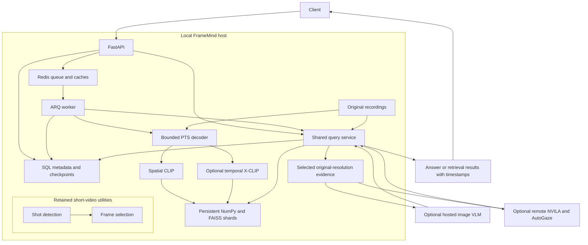
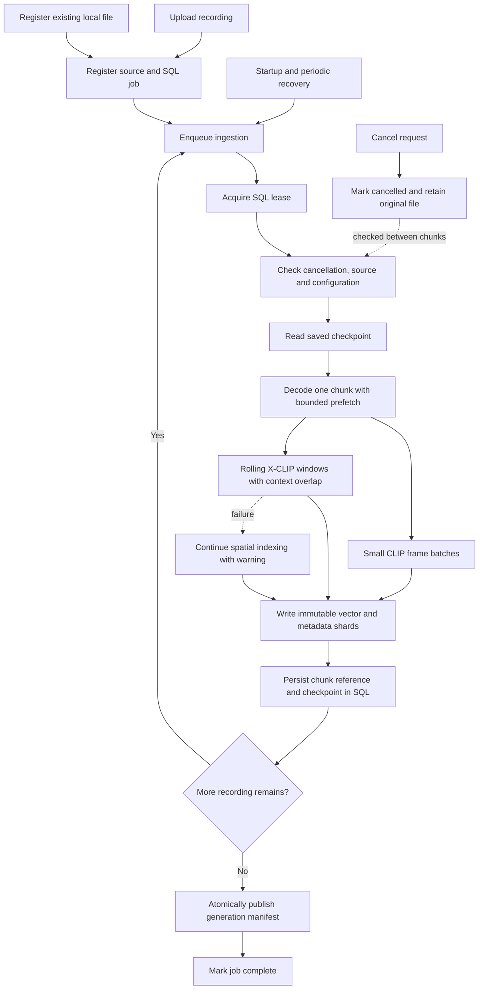
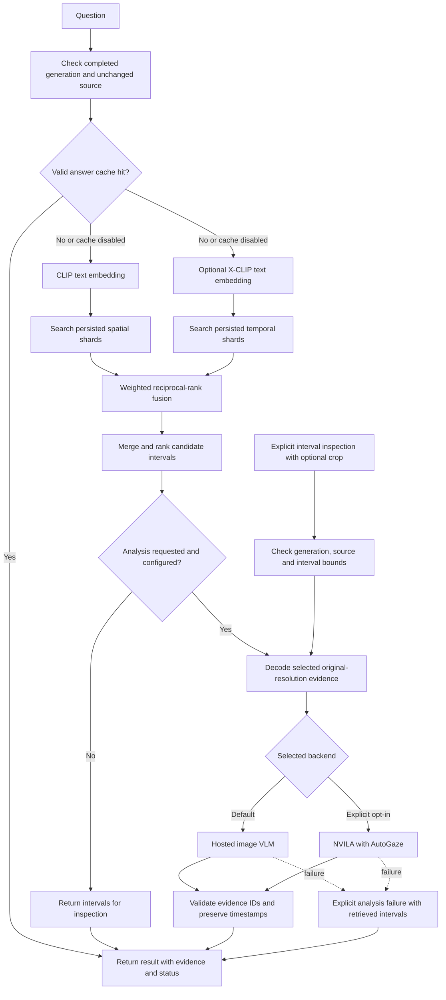

# FrameMind

Search long recordings, retrieve relevant time intervals, then inspect selected evidence at original resolution. Version 0.2 is a research prototype with a resumable indexing pipeline and an optional AutoGaze video backend.

## What works

- PTS-based decoding across the recording, in bounded chunks; original files are retained.
- Spatial CLIP and optional temporal X-CLIP embeddings, persisted in immutable NumPy/FAISS shards.
- Weighted reciprocal-rank fusion into candidate intervals; cached indexes are reused across queries.
- Detailed inspection of a chosen interval, optionally cropped, with source timestamps and validated evidence IDs.
- Shared synchronous/asynchronous query implementation, durable job status, checkpoints, retries, cancellation, and worker recovery.
- Optional NVILA + AutoGaze inference on a separate Linux NVIDIA host. It is off by default and never selected automatically.

## Features

This release does not implement live-camera monitoring, object tracking, vehicle identity matching across cameras, or automatic incident alerts. Semantic retrieval proposes candidates; it cannot certify that an event did not occur elsewhere in a recording.

## Architecture

The API and worker share local recordings, persisted indexes, and SQL metadata. Redis schedules work and provides expendable caches. Both synchronous and queued queries use the same query service. The optional GPU service receives selected evidence only.



Shot detection and the older frame-selection helpers remain available, but the long-recording worker uses chunk encoding directly. The remote GPU backend is a second-stage analysis option; it does not replace local indexing.

## Processing workflow

Each task encodes at most one chunk. Only a completed index generation becomes queryable; progress reports how much of the recording has been indexed.



## Query workflow

Retrieval finds candidate intervals using both embedding streams. Detailed inspection can revisit a chosen interval directly, without repeating retrieval. Evidence is presented to the analysis backend in time order.



The diagram expands the uncached inspection path. Inspection also supports retrieval-only output and caching. AutoGaze responses are deliberately uncached for paired measurements. Empty retrieval or unsupported evidence yields an explicit insufficient-evidence result.

## Run locally

Use Python 3.11 and a fresh virtual environment without system packages. Run these commands from the repository root:

```bat
python -m venv .venv
.venv\Scripts\activate.bat
python -m pip install -r requirements.lock
python -m pip install --no-deps -e .
copy .env.example .env
```

On Linux, activate with `source .venv/bin/activate` and copy the environment file with `cp`. The CPU lock includes development and benchmark dependencies. The first model use downloads CLIP/X-CLIP checkpoints. No VLM key is required for retrieval.

Start Redis, then the API and worker in separate terminals:

```sh
docker run --name framemind-redis -p 127.0.0.1:6379:6379 redis:8.0-alpine redis-server --appendonly yes --maxmemory-policy noeviction
uvicorn src.api.main:app --host 127.0.0.1 --port 8000
arq src.workers.pipeline.WorkerSettings
```

Alternatively, after creating `.env`, start the CPU stack:

```sh
docker compose -f docker/docker-compose.yml up --build
```

The API is at `http://127.0.0.1:8000`; set `DEBUG=true` for interactive `/docs`. `/ready` checks dependencies and returns 503 when unavailable. Compose binds ports to localhost; use an authenticated gateway before exposing the local API to other users.

## Ingest and query

For an existing file, register it without copying:

```sh
framemind-ingest "/absolute/path/to/recording.mp4"
```

The API and worker must see the same absolute source and index paths. With Compose, place recordings in the shared `data` directory and register from the worker container:

```sh
docker compose -f docker/docker-compose.yml exec worker framemind-ingest /app/data/recording.mp4
```

Or upload through the API (use `curl.exe` on Windows):

```sh
curl -F "file=@recording.mp4" http://127.0.0.1:8000/api/v1/ingest/upload
curl http://127.0.0.1:8000/api/v1/ingest/status/JOB_ID
```

Uploads default to a 20 GiB limit. Status exposes processed coverage, remaining duration, per-stream status, and warnings. Queries require a completed index. If temporal inference fails, spatial indexing can complete with an explicit warning.

Send this JSON to `POST /api/v1/query/JOB_ID`:

```json
{"query":"Where does a red car appear?","analysis_backend":"none","max_frames":10}
```

The response contains candidates selected by relevance and presented in time order. Use `analysis_backend: "default"` with `VLM_PROVIDER`, `VLM_MODEL`, and `VLM_API_KEY` configured to analyze selected images. This sends selected evidence to that provider. Without a key, the default returns retrieval results only. There is no automatic provider fallback.

Inspect a candidate with `POST /api/v1/query/JOB_ID/inspect`:

```json
{"query":"What happens to the red car?","start_ms":120000,"end_ms":130000,"max_frames":20,"analysis_backend":"default","crop":[0.2,0.2,0.8,0.9]}
```

Inspection intervals are limited to 60 seconds; crop coordinates are normalized `(left, top, right, bottom)` and optional. The response distinguishes `complete`, `retrieval_only`, `insufficient_evidence`, and `failed`. Confidence is null because similarity is not calibrated answer confidence. All evidence retains timestamps relative to the original stream, even when `include_timestamps` is false; citations require provenance.

`POST /api/v1/query/JOB_ID/async` accepts the same query body and returns a query ID. Poll `GET /api/v1/query/result/QUERY_ID`; 202 means pending, 200 returns the persisted result, and failures are explicit. Set `use_cache: false` for measurements.

## Recovery and existing data

SQL stores authoritative progress. Each worker task publishes one chunk and checkpoints it before scheduling the next. Startup and five-minute recovery scans reschedule unfinished jobs; SQL leases fence competing tasks. Redis stores queue state and optional caches, not the only copy of embeddings.

`DELETE /api/v1/ingest/JOB_ID` cancels active work but retains the recording. Schema initialization adds tables without deleting legacy data. Legacy indexes require explicit reindexing:

```sh
curl -X POST http://127.0.0.1:8000/api/v1/ingest/JOB_ID/reindex
```

Reindexing returns a **new job ID**, preserving the old job and index. Use it after changing extraction/model settings or source files. Changing files in place invalidates evidence for existing jobs. Back up both the metadata database and `data` directory; preserve absolute paths when restoring this version. Unreferenced artifacts from interrupted writes are retained and can consume disk; automatic garbage collection is not implemented.

## Project structure

```text
FrameMind/
|-- docker/
|   |-- Dockerfile                 # CPU API image
|   |-- Dockerfile.worker          # CPU worker image
|   |-- docker-compose.yml         # Local API, worker and Redis
|   |-- Dockerfile.gpu             # Separate experimental Linux GPU image
|   |-- docker-compose.gpu.yml     # Token-protected GPU service
|   |-- requirements-gpu.txt       # Direct GPU dependency pins
|   `-- requirements-gpu.lock      # Resolved GPU dependencies
|-- src/
|   |-- api/
|   |   |-- main.py                # Application lifecycle and shared services
|   |   |-- deps.py                # Dependencies
|   |   |-- middleware.py          # Request limits and logging utilities
|   |   `-- routes/                # Ingest, query, inspect and health endpoints
|   |-- ingest/
|   |   |-- stream.py              # PTS decoding, bounded prefetch and source checks
|   |   |-- validator.py           # Retained validation utility
|   |   |-- preprocessor.py        # Retained FFmpeg normalization utility
|   |   `-- extractor.py           # Retained frame-extraction utility
|   |-- ml/
|   |   |-- chunk_encoder.py       # Bounded spatial batches and temporal windows
|   |   |-- clip_scorer.py         # Spatial embeddings and text encoder
|   |   |-- temporal_encoder.py    # X-CLIP embeddings and text encoder
|   |   |-- shot_detector.py       # Retained scene-boundary utility
|   |   |-- frame_selector.py      # Retained short-video selection utility
|   |   |-- parallel_encoder.py    # Device and batching utilities
|   |   `-- embeddings.py          # Retained vector and dual-index utilities
|   |-- services/query.py          # Shared retrieval, inspection and citation validation
|   |-- storage/
|   |   |-- indexes.py             # Immutable shards, index cache and interval fusion
|   |   |-- metadata.py            # SQL jobs, checkpoints, query tasks and leases
|   |   |-- base.py                # Storage abstraction
|   |   `-- local.py               # Local storage utility
|   |-- vlm/
|   |   |-- client.py              # Hosted image VLM clients
|   |   |-- video_client.py        # Remote evidence transfer and timestamp validation
|   |   |-- prompt_builder.py      # Retained prompt-building utility
|   |   `-- aggregator.py          # Retained aggregation utility
|   |-- gpu/app.py                 # Authenticated NVILA and AutoGaze service
|   |-- workers/
|   |   |-- pipeline.py            # Chunk tasks, query tasks and recovery
|   |   |-- orchestrator.py        # SQL-authoritative job updates
|   |   `-- callbacks.py           # Retained webhook utility
|   |-- cache/redis_cache.py       # Optional answer cache and request limits
|   |-- core/                     # Configuration, models, errors and concurrency
|   `-- cli.py                    # In-place local recording registration
|-- tests/                        # Unit, integration and opt-in acceptance tests
|-- scripts/
|   |-- download_models.py        # Model-download utility
|   |-- evaluate.py               # Paired evaluation and manual-promotion gates
|   `-- test-models.cmd           # Windows real-model smoke test
|-- evaluation/                   # Manifest and human-score examples
|-- docs/                         # GPU setup, evaluation and validation records
|-- .github/workflows/ci.yml       # CPU regression and formatting checks
|-- .env.example                  # Starter configuration
|-- requirements.lock             # Resolved CPU dependencies
|-- pyproject.toml                # Package and tool configuration
|-- Makefile                      # Existing development shortcuts
`-- README.md
```

Utilities marked retained remain in the repository; their presence does not mean they run in the current ingestion/query path. For example, the worker does not automatically normalize recordings with FFmpeg, run shot detection, dispatch webhooks, or use S3 storage.

## Configuration reference

Start from [.env.example](.env.example); [Settings](src/core/config.py) defines the complete configuration. Values below are defaults unless noted.

- **Services and storage:** `REDIS_URL=redis://localhost:6379/0`, `DATABASE_URL=sqlite+aiosqlite:///./data/framemind.db`, `STORAGE_PATH=./data`, and `MAX_VIDEO_SIZE_MB=20480`.
- **Spatial encoding:** `CLIP_MODEL=openai/clip-vit-base-patch32`, `CLIP_DEVICE=cpu`, `FRAME_EXTRACTION_FPS=2`, and `SPATIAL_BATCH_SIZE=32`.
- **Temporal encoding:** `USE_TEMPORAL=true`, `XCLIP_MODEL=microsoft/xclip-base-patch32`, `TEMPORAL_FPS=8`, `TEMPORAL_STRIDE=0.5` (overlap ratio), and `TEMPORAL_BATCH_SIZE=8`. The chunk encoder derives its window length from the loaded checkpoint; `TEMPORAL_WINDOW_FRAMES=8` is not an override of that checkpoint's required frame count.
- **Chunk memory:** `CHUNK_SECONDS=60`, `DECODE_SIZE=224`, and `PREFETCH_BATCHES=2`. Spatial samples are resized before entering the queue; original-resolution frames are decoded again only for selected evidence.
- **Model identity:** `MODEL_REVISION=main` is the initial model reference. Resolved revisions are recorded per stream in the generation. A resumed job rejects revision changes rather than mixing incompatible embeddings.
- **Retrieval:** `USE_FAISS=true`, `INDEX_CACHE_MB=256`, `CANDIDATE_COUNT=50` per stream, `FUSION_ALPHA=0.5`, `MAX_INTERVALS=5`, and `CONTEXT_SECONDS=2`. Fusion weights apply to ranks, not directly comparable raw CLIP/X-CLIP scores. Setting `USE_FAISS=false` selects NumPy search over persisted vectors.
- **Hosted analysis:** `VLM_PROVIDER=openai`, `VLM_MODEL=gpt-4o`, `VLM_API_KEY` empty, and `VLM_TIMEOUT=60`. Choose a model appropriate to the selected provider. No key means retrieval-only default behavior.
- **GPU experiment:** `AUTOGAZE_ENABLED=false`, `AUTOGAZE_URL` and `AUTOGAZE_TOKEN` empty, `AUTOGAZE_TIMEOUT=300`, `VIDEO_MAX_FRAMES=128` per interval, and `VIDEO_MAX_TILES=12`. Deployment also requires the separate GPU-host revision variables described below.
- **Request limits and workers:** `RATE_LIMIT_REQUESTS=100`, `RATE_LIMIT_WINDOW=60`, and `JOB_TIMEOUT=600` seconds per task. The current worker explicitly runs one task at a time; changing the retained `WORKER_CONCURRENCY` setting does not change that limit.
- **Legacy helpers:** `MAX_FRAMES_PER_VIDEO=1000`, `TARGET_KEYFRAMES=30`, and shot-detection settings apply to retained eager-processing utilities, not total coverage or frame budgets in the new chunked worker. Retained multi-GPU utilities do not automatically distribute this worker across devices.

## ML utilities

The main entry points for this prototype are ingestion, query, and inspection. For experiments, the earlier scene-detection and selection APIs remain available for short inputs:

```python
from src.ml import ShotDetector

boundaries = ShotDetector().detect_from_video("short-video.mp4")
```

Within an async function, spatial scoring accepts PIL RGB images:

```python
from src.ml import CLIPScorer

scorer = CLIPScorer()
await scorer.load_model()
try:
    embeddings = scorer.embed_frames(pil_frames)
    scores = scorer.score_relevance(embeddings, "a person speaking")
finally:
    await scorer.unload_model()
```

Temporal encoding uses `XCLIPEncoder.encode_clips` on bounded `VideoClip` batches with the checkpoint's required number of frames. The long-video path constructs these in [chunk_encoder.py](src/ml/chunk_encoder.py); prefer the ingestion API over the older eager `extract_and_encode` helper. [FrameSelector](src/ml/frame_selector.py) remains available for combined scene/relevance/diversity selection on short videos, but is not the chunk worker's retrieval strategy.

## AutoGaze experiment

See [GPU setup and evaluation](docs/autogaze.md). The adapter applies patch pruning during **second-stage video analysis**, after local retrieval. It does not accelerate decoding or the existing CLIP/X-CLIP index build. Both gaze and no-pruning runs use the same NVILA checkpoint and sampled evidence.

The [upstream model card](https://huggingface.co/nvidia/NVILA-8B-HD-Video) identifies the checkpoint as research/development only and lists noncommercial terms. Keep this backend experimental; the FrameMind code license does not override model terms.

## Validation

```sh
ruff check src tests scripts
ruff format --check src tests scripts
pytest -q
```

External checkpoints and the two-hour resource test are opt-in:

```bat
scripts\test-models.cmd
set FM_RUN_RESOURCE_TEST=1
pytest tests/integration/test_resources.py -q -s
```

Use `scripts\test-models.cmd --offline` to reuse the downloaded project checkpoints. On Linux run `FM_RUN_MODEL_TESTS=1 pytest tests/integration/test_model_smoke.py -q` and prefix the resource command with `FM_RUN_RESOURCE_TEST=1`. The resource test generates a two-hour 1080p recording at 2 FPS and uses deterministic encoder doubles. It checks complete coverage, retrieval of the final event, and a 4 GiB process-memory ceiling. It is not a model throughput or real-world accuracy benchmark. See [validation notes](docs/validation.md) for measured results and remaining checks.

## Development and roadmap

Use `python -m pytest --cov=src` for coverage and `ruff format src tests scripts` for formatting. The Makefile retains development shortcuts for shells with Make installed; the commands above also work directly in Command Prompt. Strict type checking remains configured, but was not included in the passing validation checks because Windows blocked the mypy launcher.

Implemented in this version: persistent dual-stream retrieval, chunk recovery, interval inspection, shared async query execution, hosted VLM client integration, and the optional AutoGaze service/benchmark harness. Implemented does not mean validated on representative surveillance footage; the validation record distinguishes tested components from deployment work still required.

Still to validate or build:

- Real Redis/ARQ deployment and representative long-recording throughput/accuracy.
- GPU inference, gaze/no-gaze evaluation, and a manual decision on AutoGaze adoption.
- PostgreSQL deployment validation; SQLite is the locally tested metadata backend.
- S3-backed recording/index storage, WebSocket progress, and dedicated batch-ingestion controls.
- Audio transcription, live-camera support, object tracking, cross-camera matching, and incident alerts.
